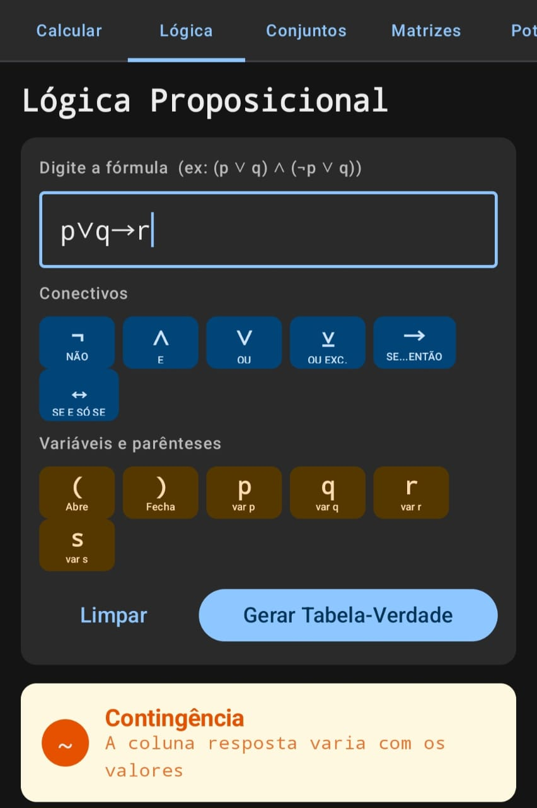
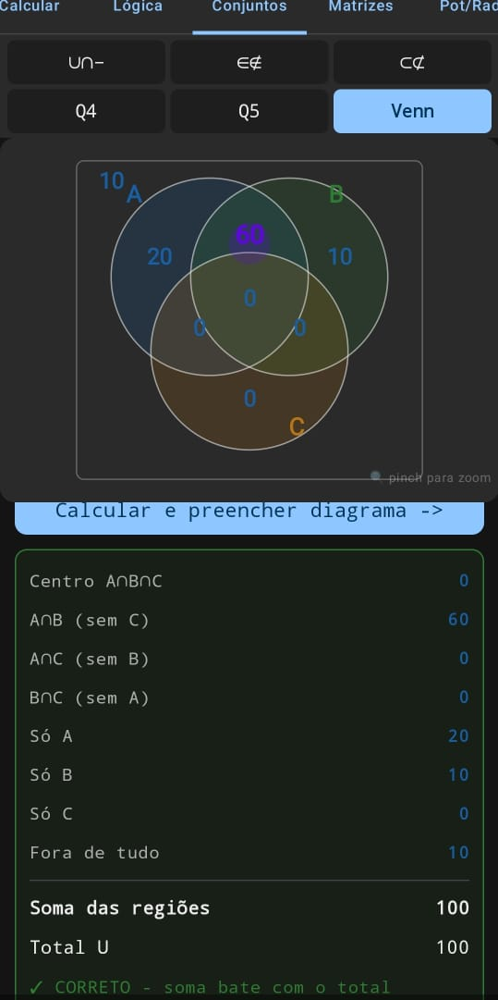
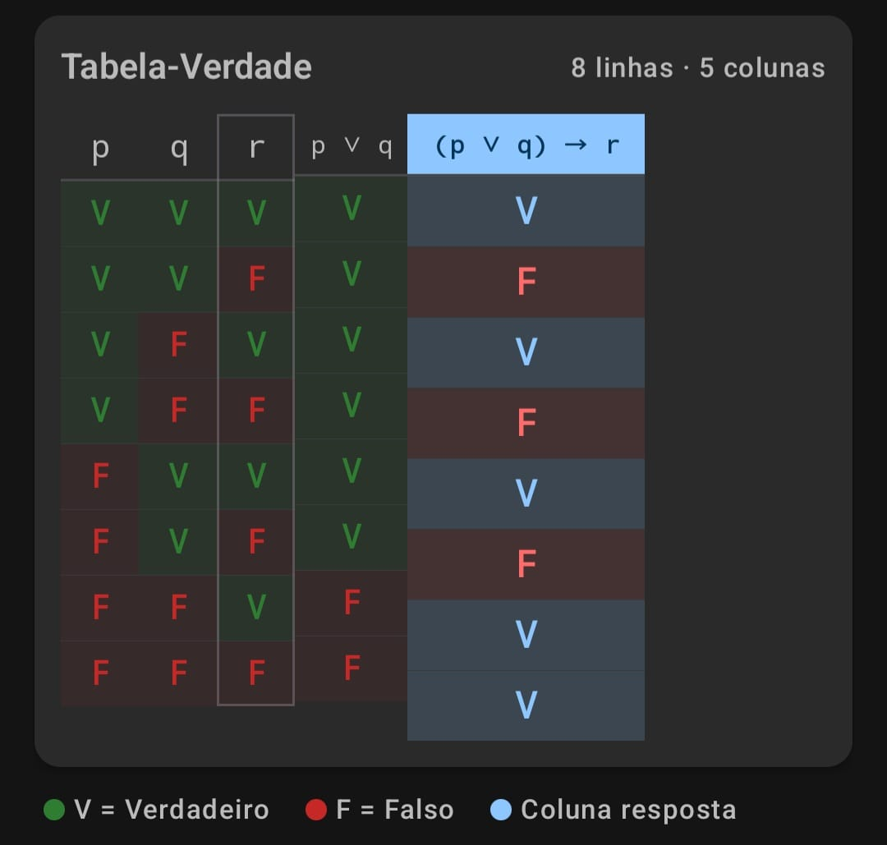
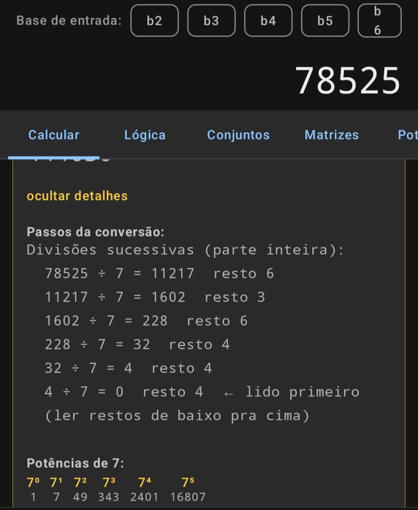

# BaseCalc — Calculadora Multi-Base para Estudantes

Calculadora Android que exibe resultados simultaneamente nas bases 2, 3, 4, 5, 6, 7, 8, 9, 10 e 16,
com passo a passo das divisões para sala de aula.

## Screenshots

As imagens ficam em `BaseCalc/docs/images/`:
- `tabela-verdade.png`
- `conjuntos-venn.png`
- `tabela-resultado-verdade.png`
- `calculadora-home.png`






---

## Estrutura do projeto

```
BaseCalc/
└── app/
    └── src/main/
        ├── cpp/
        │   ├── BaseConverter.h        ← interface do motor C++
        │   ├── BaseConverter.cpp      ← lógica de conversão (sem arredondamento)
        │   ├── jni_bridge.cpp         ← ponte JNI → retorna JSON pro Kotlin
        │   └── CMakeLists.txt         ← configuração do NDK
        └── java/com/basecalc/
            ├── BaseConverterJNI.kt    ← objeto Kotlin que carrega a lib nativa
            ├── CalcModels.kt          ← data classes (BaseEntry, CalcResult, etc.)
            ├── CalcViewModel.kt       ← lógica de UI + parse do JSON nativo
            ├── MainActivity.kt        ← entry point
            └── ui/
                └── CalculatorScreen.kt ← tela Compose completa
```

---

## Pré-requisitos

| Ferramenta         | Versão mínima |
|--------------------|---------------|
| Android Studio     | Hedgehog (2023.1) ou superior |
| NDK                | 27.x (instalar em SDK Manager → SDK Tools → NDK) |
| CMake              | 3.22.1 (instalar em SDK Manager → SDK Tools → CMake) |
| Kotlin             | 1.9+ |
| compileSdk         | 35 |
| minSdk             | 26 (Android 8.0) |

---

## Como abrir e rodar

1. Abra o **Android Studio**.
2. `File → Open` → selecione a pasta `BaseCalc/`.
3. Aguarde o Gradle sync.
4. Vá em **SDK Manager → SDK Tools** e confirme que NDK e CMake estão instalados.
5. Conecte um celular Android (ou use o emulador x86_64).
6. Clique em **Run ▶**.

O Gradle vai chamar o CMake automaticamente, compilar o C++ para `arm64-v8a`
(celular real) ou `x86_64` (emulador) e empacotar tudo no APK.

---

## Como o motor funciona

### Conversão inteira (divisões sucessivas)
```
37 para base 4:
  37 ÷ 4 = 9   resto 1
   9 ÷ 4 = 2   resto 1
   2 ÷ 4 = 0   resto 2
  → ler de baixo: (211)₄
```
Os passos são gerados em `BaseConverter.cpp → stepsToString()` e exibidos na UI
ao clicar em "ver como converteu".

### Parte fracionária (multiplicações sucessivas)
```
0.5 para base 2:
  0.5 × 2 = 1.0 → dígito 1 (terminou: exato)
  → (0,1)₂
```
Detecção de dízima periódica: a função registra o estado fracionário a cada passo;
se o mesmo estado se repetir → encontrou o bloco periódico. Ex: 1/3 em base 10 = 0,(3...).

### Avaliador de expressões
Parser recursivo descendente em C++ puro, sem bibliotecas externas.
Suporta `+  -  *  /  %  (  )` e números decimais.

---

## Próximas funcionalidades sugeridas

- [ ] Modo "verificação": digitar um número em qualquer base e converter para decimal
- [ ] Histórico de cálculos
- [ ] Tabela de potências (2⁰…2¹⁰, 7⁰…7⁵ etc.) integrada
- [ ] Cores personalizáveis por base
- [ ] Suporte a adição diretamente em binário/hex com carry visual

---

## Nota sobre (171)₄

O exercício c) da lista 2 contém um erro: o dígito **7** não existe em base 4
(dígitos válidos: 0, 1, 2, 3). Provavelmente o enunciado deveria ser **(171)₈**,
que equivale a 121 em decimal. Confirme com o professor.

---

## Autores e Créditos

- **Autor principal:** Walbarellos
- **Assistente técnico:** ChatGPT
